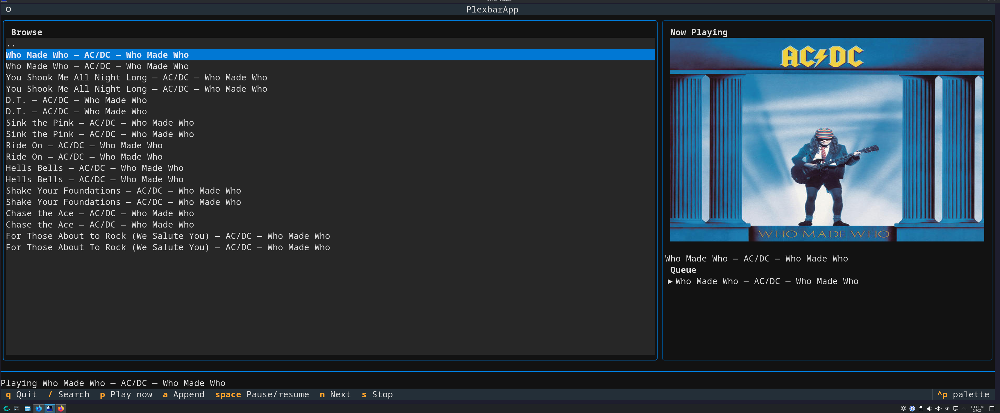

# Plexbar

Plexbar is a keyboard-driven terminal music player for Plex. It gives you a
simple Textual TUI for browsing and playing your Plex music library without
opening a web browser.



## Features

- First-run Plex connection setup
- Browse by Artists, Albums, Tracks, and Playlists
- Search your Plex music library
- Queue tracks, albums, artists, and playlists
- Play, pause/resume, stop, and skip with keyboard shortcuts
- Local playback through `mpv`

## Requirements

- Python 3.12+
- [`uv`](https://docs.astral.sh/uv/)
- [`mpv`](https://mpv.io/) installed and available on `PATH`
- A Plex server with at least one music library
- A Plex token

## Installation

Install Plexbar as a standalone command with `uv`:

```bash
uv tool install plexbar
```

Run Plexbar:

```bash
plexbar
```

## Installation for development

Clone the repository and sync dependencies with `uv`:

```bash
git clone git@github.com:feoh/plexbar.git
cd plexbar
uv sync
```

Run Plexbar from the project checkout:

```bash
uv run plexbar
```

## First-run setup

If `~/.config/plexbar/config.toml` does not exist, Plexbar opens a setup screen
and prompts for:

1. Plex base URL, for example `http://puppy:32400` or `http://127.0.0.1:32400`
2. Plex token
3. Default music library

The config file is written to:

```text
~/.config/plexbar/config.toml
```

Plexbar writes this file with user-only permissions where supported. Do not
commit or share your Plex token.

### Finding your Plex token

One common method:

1. Open Plex Web and sign in.
2. Open browser developer tools.
3. Go to the Network tab.
4. Refresh Plex Web or browse to a media item.
5. Search requests for `X-Plex-Token`.
6. Copy the token value only.

## Usage

The top-level browser contains:

- Artists
- Albums
- Tracks
- Playlists

Press `Enter` to drill down into artists, albums, and playlists. Press `Enter`
on a track to enqueue it.

## Keybindings

| Key | Action |
| --- | --- |
| `/` | Search Plex music |
| `Enter` | Select/drill down, or enqueue focused track |
| `p` | Play focused track/album/artist/playlist immediately and replace queue |
| `a` | Append focused track/album/artist/playlist to queue |
| `Space` | Pause/resume |
| `n` | Next track |
| `s` | Stop playback |
| `q` | Quit |

## Local validation

```bash
uv run ruff check .
uv run ruff format --check .
uv run pytest
uv run mypy src/plexbar tests
```

## Current limitations

Plexbar currently launches `mpv` as a subprocess for each track. Future versions
may switch to mpv IPC for richer playback state and automatic end-of-track
advancement.
